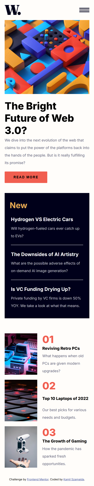
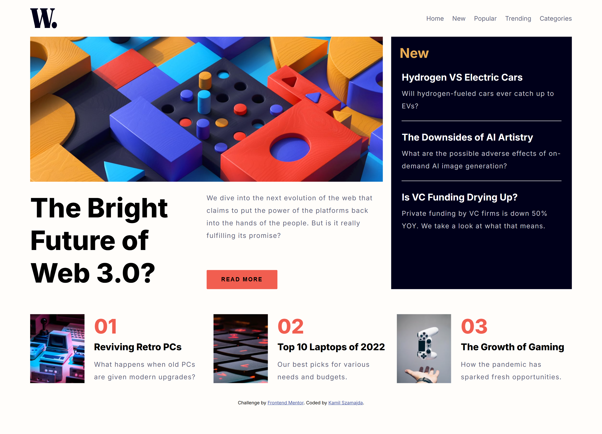

# Frontend Mentor - News homepage solution

This is a solution to the [News homepage challenge on Frontend Mentor](https://www.frontendmentor.io/challenges/news-homepage-H6SWTa1MFl). Frontend Mentor challenges help you improve your coding skills by building realistic projects. 

## Table of contents

- [Overview](#overview)
  - [The challenge](#the-challenge)
  - [Screenshot](#screenshot)
  - [Links](#links)
- [My process](#my-process)
  - [Built with](#built-with)
  - [What I learned](#what-i-learned)
  - [Continued development](#continued-development)
- [Author](#author)

## Overview

### The challenge

Users should be able to:

- View the optimal layout for the interface depending on their device's screen size
- See hover and focus states for all interactive elements on the page

### Screenshot

Mobile display
  


Desktop display
  

### Links

- Solution URL: [https://github.com/Marionmancer/news-homepage.git]
- Live Site URL: [https://marionmancer.github.io/news-homepage/]

## My process

### Built with

- HTML5 markup
- Semantic HTML
- CSS custom properties
- CSS Flexbox and Grid
- Mobile-first workflow
- JavaScript for side-menu and components change

### What I learned

Throughout the development of this project, I significantly improved my ability to work with modern layout techniques such as CSS Grid, which allowed me to build a flexible, responsive structure with minimal code. For example, I used this grid configuration to organize the main content and sidebar efficiently:

```css
#main-container {
  margin: 20px auto;
  width: 90%;
  display: grid;
  grid-template-columns: 2fr 1fr;
}
```

I also built a responsive navigation menu for mobile devices that toggles visibility using vanilla JavaScript. Implementing this from scratch taught me how to manipulate DOM elements and CSS dynamically. Here's the JavaScript function responsible for opening the side navigation:

```js
function openNav() {
  document.getElementById("opacity-div").style.width = "100%";
  document.getElementById("mySidenav").style.width = "65%";
}
```

To provide a better user experience across devices, I added logic to change the main article image based on screen size. Instead of using only CSS media queries, I used JavaScript’s resize event to dynamically update the image source, allowing for more precise control:

```js
window.addEventListener('resize', function(event) {
  if (event.target.outerWidth <= 425) {
    document.querySelector("#main-article-container > img").src = "./assets/images/image-web-3-mobile.jpg";
  } else {
    document.querySelector("#main-article-container > img").src = "./assets/images/image-web-3-desktop.jpg";
  }
});
```
Finally, I paid attention to detail by adding hover effects and styling that give the UI a polished feel. For example, this simple yet effective rule changes the button's look on hover, reinforcing interactivity:

```css
.read-more-btn:hover {
  cursor: pointer;
  background-color: hsl(240, 100%, 5%);
  color: white;
}
```
These implementations helped me grow not only as a developer in terms of technical ability but also in understanding how small enhancements can greatly improve the user interface and experience.

### Continued development

In future iterations of this project, I plan to improve accessibility by using more semantic HTML elements such as <nav>, <main>, and <section>. I also intend to refactor the JavaScript code by separating concerns into modular functions and replacing the resize event with matchMedia for more efficient responsiveness handling. 

## Author

- Frontend Mentor - [@Marionmancer](https://www.frontendmentor.io/profile/Marionmancer)
- GitHub - [@Marionmancer](https://github.com/Marionmancer)
